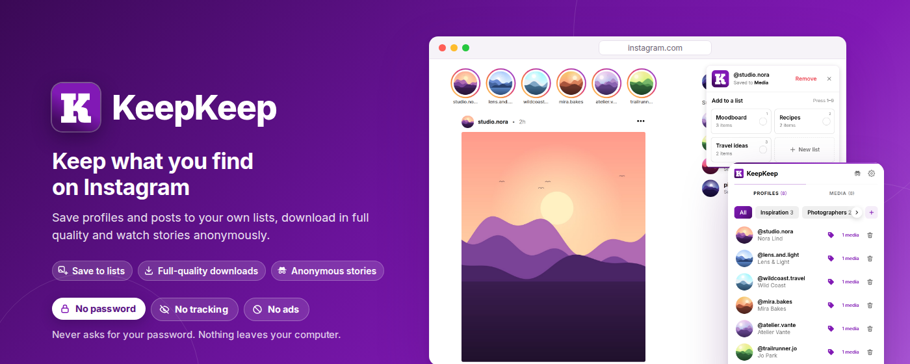
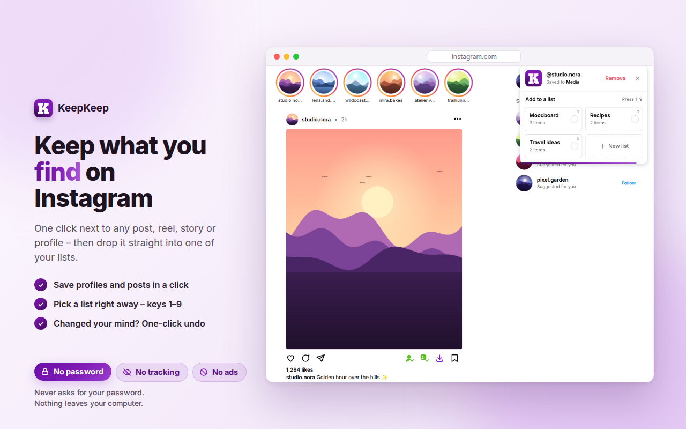
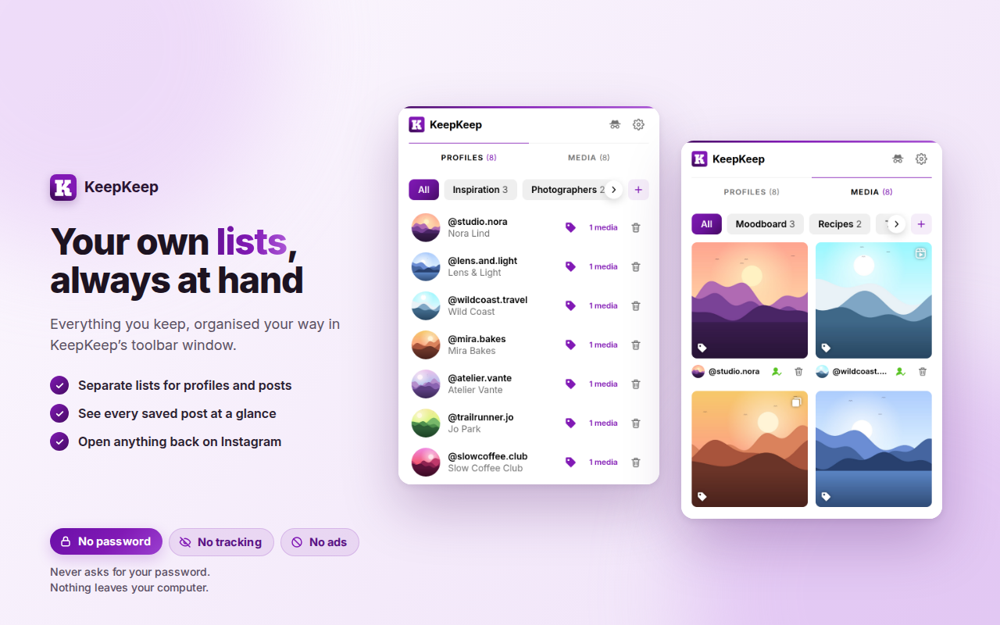
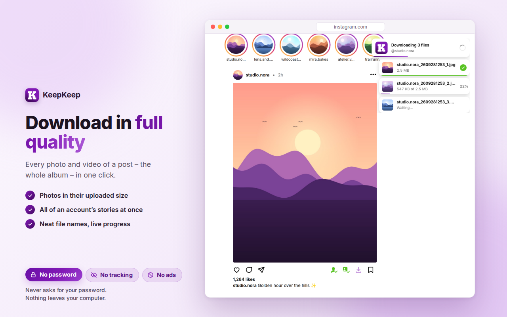
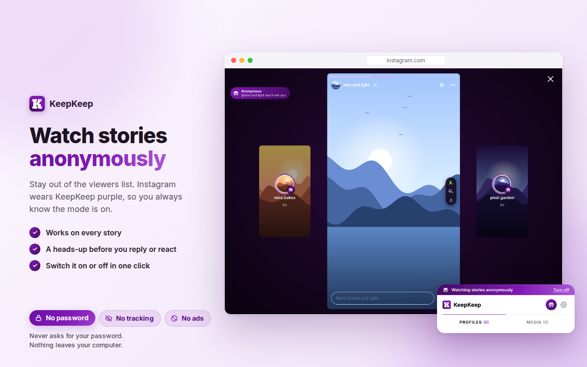
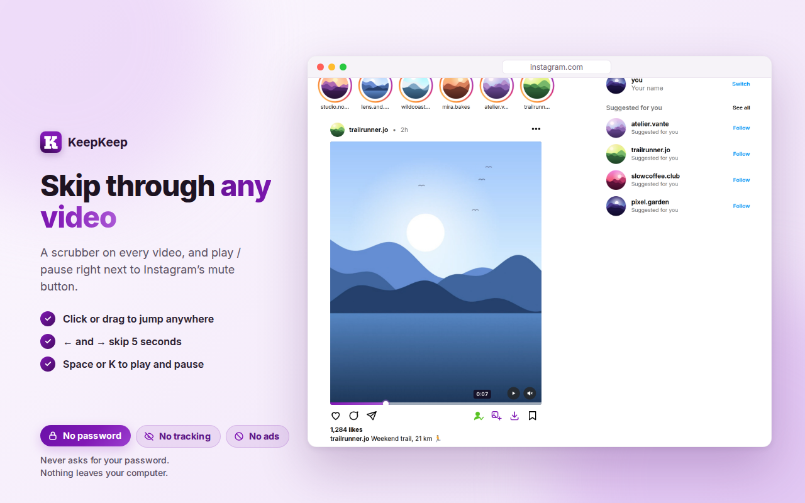

# KeepKeep

**KeepKeep – Downloader & Anonymous Story Viewer for Instagram** is a Chrome extension for instagram.com: save profiles and posts to your own lists, download photos and videos in full quality, watch stories anonymously and skip through any video. Everything stays in your browser.

| | |
| --- | --- |
|  |  |
|  |  |
|  | |

## How it works

- While on `instagram.com`, drag the URL from the address bar (or a profile/post link on the page) over the page.
- A card appears in the top-right corner; drop the link on it.
- Or use the icons at the top of the extension's popup: **Profile**, **Media** and **Download** act on the post or profile open in the current tab (⚙ opens the settings).

There are also KeepKeep buttons on Instagram itself:

- **Profile**, **Media** and **Download** icons in every post's action bar, just left of Instagram's save icon (home feed, post page and post popup),
- in the corner of post thumbnails when you hover them (profile grid, explore),
- **Save profile** next to the Follow button on profile pages,
- in the Reels viewer, icons at the top of the right-hand icon column: **Profile** adds the reel's owner, **Media** adds the reel itself, **Download** downloads it.

Once an item is saved its button turns green and shows **Saved**. Hovering it turns it into a red **Remove** (like "Following" → "Unfollow" on Instagram); clicking removes the item, and the corner card offers **Undo** for a few seconds.

### Stories

While the pointer is over a story, a small pill on its right edge has **Profile** (add the owner), **Media** (add the story) and **Download** (all of the account's current stories at once, as `<username>_<YYMMDDHHmm>_story.jpg/.mp4`); **D** does the same. None of these marks the story as seen.

### Watching stories anonymously

Turn on **Watch stories anonymously** in the popup's settings (⚙) and KeepKeep stops the request that tells Instagram you've seen a story, so you don't appear in its viewers list (`extension/stories-main.js`). Stories you watch stay unseen for you too; replies and likes are still visible to the owner. Switch it with the mask button in the popup's header or in the settings (⚙).

Like a private window, Instagram "wears the veil" while it's on (`extension/veil.js`, `extension/veil.css`): Instagram's blue turns KeepKeep purple and white a faint lilac, story rings turn purple (with a mask badge in the stories tray), a mask capsule sits top right, and in the story viewer the stage turns deep purple with a pill naming whose story you watch. Focusing the reply box or pointing at a reaction shows a heads-up, since the owner would see those. When Instagram asks "View as …? … will be able to see that you viewed their story" (stories opened from a link), KeepKeep replaces that text, in Instagram's own style, with "Watching anonymously · <owner> won't see that you viewed their story" (and a mask badge on your picture) while the mode is on, and otherwise adds a **View anonymously** button that turns the mode on and opens the story. The toolbar icon gets a mask too.

### Downloading

**Download** saves every photo and video of a post in the highest resolution Instagram offers. **Shift-click** it, or press **D** with the pointer over the post, to save only the photo or video on screen of an album. Files are named after the owner and the time the post was published, e.g. `telma_2507271432.jpg` (YYMMDDHHmm); album items get a number: `telma_2507271432_1.jpg`, `telma_2507271432_2.mp4`.

Files go straight to `Downloads/KeepKeep/`, each photo and video as its own file – no ZIP, no questions, no windows.

Photos come in their uploaded size (up to 3072 px, found on the post's embed page) or, if you pick **Standard** in the popup's settings (⚙), in the largest size Instagram shows (up to 1080 px). If the original can't be fetched, the standard size is used.

Videos: Instagram's own single video file stops at about 720p, but it also offers a 1080p version as separate video and audio streams. KeepKeep downloads both and joins them into one MP4 inside the extension. The popup's settings (⚙) and the Settings page have a **Video quality** choice: **Best** (default) converts to H.264 so the file plays everywhere, **Original** keeps Instagram's VP9 video as is (instant and smaller, but some players such as macOS Quick Look can't open it), **Standard** saves the single ~720p file. If anything goes wrong, the single file is saved instead and the progress balloon says so.

While downloading, balloons on the right show the overall progress and each photo / video with its thumbnail, size and progress; they disappear a few seconds after it's saved.

### Video controls

Every video (feed, post page, post popup or Reels) always shows a thin scrubber along its bottom edge (click or drag to any point; hover shows the time there) and a play / pause button next to Instagram's mute button. Instagram's own username, Follow button and caption stay clickable, and the controls hide while something (like a post popup) covers the video. (Not shown in Stories.) While the mouse is over a video, **← / →** skip 5 seconds and **Space** or **K** play / pause; elsewhere those keys keep doing what Instagram uses them for.

### KeepKeep's own page

Everything you saved also has a page of its own in a full browser tab. Open it with the **Open KeepKeep** button in the popup. Profiles and Media show as big grids you can search and filter; select several items to remove, file or download them together, or drag them onto a list in the sidebar. The same page has Settings, Backup (export and import) and About, welcomes you after installing and tells you what's new after an update.

### After adding

Everything you add is saved right away. The corner card then shows what was added and, below it, your lists as large boxes that slide open. Click boxes (or press **1–9**) to put the item into those lists, or create a new list from the **+ New list** box. With many lists a search field appears and the boxes scroll. The card closes on its own after a few seconds; a bar at the bottom shows the time left, and it pauses while your mouse is over the card.

KeepKeep has two independent sections:

- **Profiles:** accounts you add on purpose (profile link, profile page button, or the Reels **Profile** icon).
- **Media:** posts, reels and videos. Each item is grouped under its owner with the owner's picture, but adding media **does not** add the owner to Profiles. Use **+ Profile** on a media group to add the owner later if you want.

Removing a profile keeps its media, and vice versa.

### Lists

Profiles and media each have their own lists (e.g. profile lists "Designers", "Friends"; media lists "Fashion", "Inspiration"). One item can be in several lists.

- Create a list with the **+** button at the right end of the list row.
- Click a list to show only what's in it; **All** shows everything. With many lists the row scrolls sideways: use the arrow buttons, the mouse wheel or a trackpad.
- While a list is selected, the bottom bar shows its name with **Rename** and **Delete list**. Deleting asks for confirmation and keeps the list's items saved.
- Use the tag button on a profile or media thumbnail to pick its lists.
- On Instagram, right after adding something, the corner card shows the matching lists so you can file the item immediately.

In the popup, profile pictures and usernames are links: right-click → *Open link in new tab* opens the profile. A normal click on a username in Media shows only that user's media.

Profile pictures and cover images are stored inside the extension as small thumbnails, so they keep showing even after Instagram's image links expire. If some detail can't be fetched at the moment (network error, etc.), it's filled in in the background the next time you open Instagram.

## Installation

1. Download the repository as a ZIP and extract it.
2. Open `chrome://extensions` in Chrome.
3. Turn on **Developer mode** in the top-right corner.
4. Click **Load unpacked** and select the `extension` folder.
5. Reload any open Instagram tabs.

After updating the extension, click its reload (⟳) button on `chrome://extensions` and reload your Instagram tabs.

## Chrome Web Store

Everything for publishing – listing texts, privacy answers, screenshots and promo tiles – is in [`store/`](store/README.md); the privacy policy page is [`docs/privacy.html`](docs/privacy.html). `./scripts/package.sh` builds the ZIP to upload.

## Roadmap

Planned features are listed in [ROADMAP.md](ROADMAP.md).

## Third-party

[Mediabunny](https://github.com/Vanilagy/mediabunny) 1.61.1 (MPL-2.0, unmodified) joins and converts videos: `extension/lib/mediabunny.min.mjs`, license in `extension/lib/mediabunny.LICENSE`.
